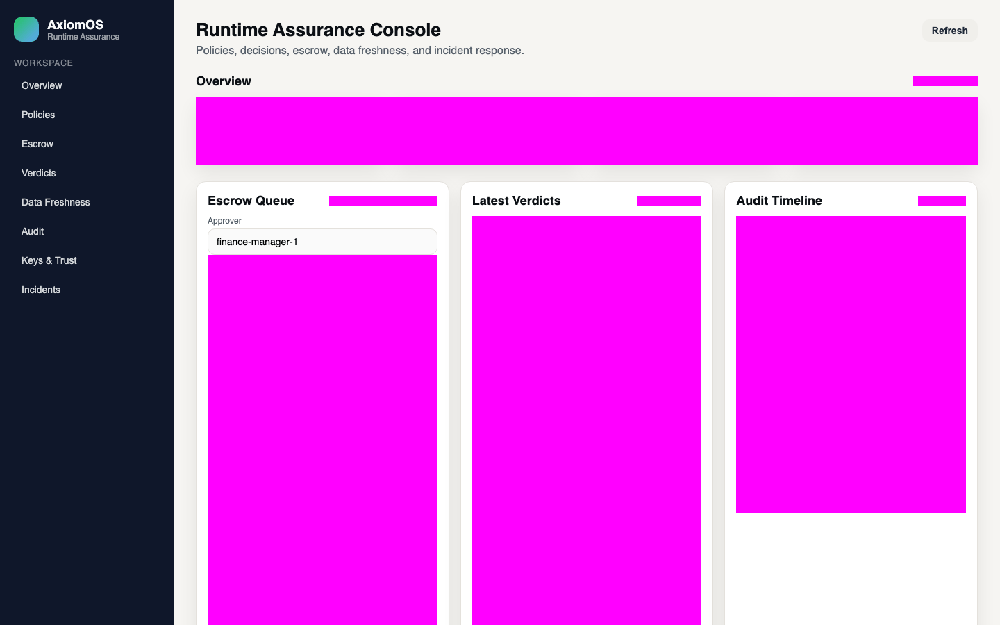

<p align="center">
  
</p>

<h1 align="center">Invariant</h1>

<p align="center">
  <strong>Runtime Assurance Kernel for AI Agent Systems</strong><br/>
  <em>Deterministic policy enforcement between agent decisions and real-world execution</em>
</p>

<p align="center">
  <a href="https://github.com/HabrielStark/invariant/actions/workflows/ci.yml"></a>
  <a href="./LICENSE"></a>
  
  
  
  
</p>

---

## What is Invariant?

Invariant is a **runtime assurance kernel** that sits between an AI agent's decision and its real-world execution. Every action intent is cryptographically signed, verified against deterministic policies, and produces one of five verdicts:

| Verdict | Meaning |
|---------|---------|
| ✅ `ALLOW` | Execute the side effect |
| 🛡️ `SHIELD` | Safe degradation (`READ_ONLY` · `SMALL_BATCH` · `REQUIRE_APPROVAL` · `DRY_RUN`) |
| ⏳ `DEFER` | Retry later, never commit |
| 🔒 `ESCROW` | Requires explicit human approval |
| 🚫 `DENY` | Hard stop with minimal counterexample |

---

## Why Invariant?

- 🔐 **Deterministic Policy Evaluation** — Canonical JSON hashing (RFC 8785), ed25519 cert verification
- 🔁 **Anti-Replay & Idempotency** — Nonce + TTL replay protection, actor-scoped dedupe
- ✍️ **Escrow Approvals** — Separation of Duties with explicit state machine
- 📋 **Full Audit Trail** — Append-only audit records with replay endpoint
- 🧮 **SMT Formal Verification** — Z3-backed policy constraint checking with counterexamples
- 📊 **Prometheus Metrics** — Verdict counters, latency histograms, shield/escrow gauges
- 🏛️ **GDPR Compliance** — Subject access, erasure, and access request endpoints
- 🔌 **Adapter Ecosystem** — OpenClaw, Palantir Foundry (first-class adapters)

---

## Architecture

```
                    ┌─────────────────────────────────┐
                    │         Agent / Tool / Node      │
                    └────────────────┬────────────────┘
                                     │ ActionIntent + ActionCert
                                     ▼
                    ┌─────────────────────────────────┐
                    │     Invariant Gateway :8080      │
                    │  (Auth · Rate-Limit · Routing)   │
                    └──┬──────────┬──────────┬────────┘
                       │          │          │
              ┌────────▼──┐  ┌───▼───┐  ┌───▼────┐
              │ Verifier   │  │Policy │  │ State  │
              │ :8081      │  │:8082  │  │ :8083  │
              │ Ed25519    │  │DSL    │  │Snapshot│
              │ SMT / Z3   │  │RBAC   │  │Events  │
              └────────────┘  └───────┘  └────────┘
                       │          │          │
              ┌────────▼──────────▼──────────▼────────┐
              │     PostgreSQL  ·  Redis  ·  Kafka     │
              └───────────────────────────────────────┘
```

---

## Quick Start

### One-Command Bootstrap (Docker Compose)

```bash
./scripts/bootstrap.sh
```

This starts all services:

| Service | Port | Description |
|---------|------|-------------|
| `gateway` | `:8080` | Main API entry point |
| `verifier` | `:8081` | Cert verification + SMT |
| `policy` | `:8082` | Policy evaluation engine |
| `state` | `:8083` | Belief state + snapshots |
| `mock-ontology` | `:8084` | Development ontology mock |
| `tool-mock` | `:8085` | Development tool executor mock |

### Make a Decision

```bash
curl -X POST http://localhost:8080/v1/decide \
  -H "Content-Type: application/json" \
  -H "Authorization: Bearer <token>" \
  -d '{
    "intent": {
      "action": "transfer_funds",
      "actor": "agent-007",
      "target": "account-42",
      "params": {"amount": 50000, "currency": "USD"}
    },
    "cert": {
      "kid": "key-1",
      "signature": "<ed25519-sig>",
      "nonce": "unique-nonce-123",
      "expires_at": "2026-03-01T00:00:00Z"
    }
  }'
```

Response:
```json
{
  "verdict": "ESCROW",
  "decision_id": "dec-abc-123",
  "reason": "amount_exceeds_threshold",
  "shield": null,
  "escrow_id": "esc-xyz-789",
  "counterexample": null
}
```

---

## OpenClaw Integration

First-class OpenClaw adapter with HTTP Proxy and WebSocket Node modes:

```bash
# Run the full end-to-end demo
./scripts/demo_openclaw_invariant.sh
```



**Flow:** Action → `ESCROW` → Approve → `ALLOW` → Replay (drift: false)

See [adapters/openclaw/README.md](adapters/openclaw/README.md) for full integration docs.

---

## Developer Commands

```bash
make fmt              # Format code
make lint             # Go vet
make test             # Run all tests with race detection
make build            # Build all services
make gosec            # Static security analysis
make vuln             # Govulncheck vulnerability scan
make sbom             # Generate CycloneDX SBOM
make trivy            # Trivy critical vulnerability scan
make smoke            # Smoke test suite (Docker Compose)
make contract         # Contract test suite
make chaos            # Chaos engineering tests
make perf             # Performance benchmarks
make self-audit       # Full self-audit pipeline
make pentest-external # External black-box pentest
```

### Coverage Gate

```bash
./scripts/check-go-coverage.sh 85.0 coverage_all.out -race
```

Current coverage: **89.5%** (threshold: 85%)

---

## Security

| Control | Implementation |
|---------|---------------|
| Intent Hashing | `SHA-256(canonical(intent) \| policy_version \| nonce)` (RFC 8785) |
| Cert Verification | Ed25519 signed payload with intent hash binding |
| Replay Protection | Redis `SETNX` nonce + TTL + monotonic sequence guard |
| Idempotency | Actor-scoped `idempotency_key` dedupe for terminal verdicts |
| Key Lifecycle | Register / revoke / rotate via Policy API |
| Audit Integrity | Append-only DB trigger (denies `UPDATE`/`DELETE` on `audit_records`) |
| Network Policy | K8s default-deny + allow-list; Compose internal-only DB/Redis |
| GDPR | Subject access export, right to erasure, access request logging |
| Rate Limiting | Distributed Redis rate-limiter with anomaly incident creation |

Full threat model: [docs/threat-model-2026-02-12.md](docs/threat-model-2026-02-12.md)

---

## Metrics & Observability

Prometheus metrics at `/metrics/prometheus`:

```
invariant_verdict_total{verdict="ALLOW",reason="policy_pass"}
invariant_verify_latency_ms{quantile="0.95"}
invariant_shield_total{type="READ_ONLY"}
invariant_escrow_total{state="PENDING"}
openclaw_adapter_requests_total
```

Grafana dashboards: [`infra/grafana/dashboards/`](infra/grafana/dashboards/)

---

## Project Structure

```
invariant/
├── cmd/                    # Service entry points
│   ├── gateway/            # Main API gateway (8080)
│   ├── verifier/           # Cert + SMT verification (8081)
│   ├── policy/             # Policy evaluation engine (8082)
│   ├── state/              # Belief state + snapshots (8083)
│   ├── axiomctl/           # CLI management tool
│   ├── axiomdsl-lsp/       # Policy DSL language server
│   ├── migrator/           # Database migration runner
│   └── ...                 # Mock services for development
├── pkg/                    # Shared libraries
│   ├── auth/               # OIDC + ABAC authentication
│   ├── audit/              # Append-only audit trail
│   ├── escrowfsm/          # Escrow state machine
│   ├── smt/                # Z3 SMT solver integration
│   ├── policyeval/         # Policy evaluation engine
│   ├── store/              # PostgreSQL data access
│   ├── metrics/            # Prometheus instrumentation
│   ├── telemetry/          # OpenTelemetry tracing
│   └── ...                 # 21 packages total
├── adapters/               # External system adapters
│   └── openclaw/           # OpenClaw HTTP proxy + WS node
├── sdk/                    # Client SDKs
│   └── ts/                 # TypeScript SDK
├── ui/console/             # React + Vite management console
├── infra/                  # Infrastructure configs
│   ├── docker-compose/     # Local development stack
│   ├── k8s/                # Kubernetes manifests
│   ├── grafana/            # Dashboard definitions
│   └── prometheus/         # Alert rules
├── migrations/             # PostgreSQL migrations
├── scripts/                # Automation scripts
├── docs/                   # Documentation
└── .github/workflows/      # CI/CD pipeline
```

---

## CI Pipeline

5-stage pipeline with SHA-pinned GitHub Actions:

```
verify → smoke → contract → chaos → perf
```

**Verify** includes: fmt check, vet, race-detected tests (≥85% coverage gate), gosec, govulncheck, UI build + audit, SBOM generation (Go + UI), Trivy critical scan.

---

## Documentation

| Document | Description |
|----------|-------------|
| [API Reference](docs/api.md) | Full endpoint documentation |
| [Deployment Guide](docs/deployment.md) | Production deployment instructions |
| [Security Policy](SECURITY.md) | Vulnerability reporting + hardening baseline |
| [Threat Model](docs/threat-model-2026-02-12.md) | STRIDE analysis with 15 threat scenarios |
| [Incident Runbook](RUNBOOK.md) | 9 operational incident response procedures |
| [SDK Guide](docs/sdk.md) | Go + TypeScript SDK usage |
| [DSL Reference](docs/dsl.md) | Policy DSL specification |
| [Secrets Management](docs/secrets.md) | Key management and rotation |
| [Roadmap](ROADMAP.md) | v0.1.x → v0.3.0 feature plans |
| [Changelog](CHANGELOG.md) | Release history |

---

## Contributing

See [CONTRIBUTING.md](CONTRIBUTING.md) for development setup, PR requirements, and commit style guidelines.

## License

This project is licensed under the [MIT License](LICENSE).

## Attribution

See [ATTRIBUTION.md](ATTRIBUTION.md) for dependency credits and [LICENSES.txt](LICENSES.txt) for transitive license tracking.
